# stratux-avionics

A cockpit display that renders ADS-B traffic (1090 MHz), UAT traffic + FIS-B weather (978 MHz)
and own-ship GPS position **straight to a DSI panel** — no desktop, no compositor, no browser.
A headless [Stratux](https://github.com/stratux/stratux) backend does the RF work; one Rust
process renders to DRM/KMS through GBM + EGL + [FemtoVG](https://github.com/femtovg/femtovg).

Contents:
[The panel](#the-panel) ·
[Hardware](#hardware) ·
[Status](#status) ·
[How it fits together](#how-it-fits-together) ·
[Developing without a Pi](#developing-without-a-pi) ·
[Getting a shell on the Pi](#getting-a-shell-on-the-pi) ·
[Building and deploying](#building-and-deploying) ·
[Cautions](#cautions) ·
[Measured results](#measured-results) ·
[Reference notes](#reference-notes)

## Why this exists

The alternatives put something between the radios and the pilot's eyes. Stratux's own web UI
needs a browser; an EFB tablet on the Stratux WiFi needs a second device that has to stay awake,
stay paired and stay charged. Both add latency and failure surface to a display whose whole job
is to be trustworthy at a glance.

This is **only the display client**, plus the OS hardening around it. Stratux already does the
hard part — `dump1090`, `dump978`, u-blox GPS handling — and this project deliberately does not
re-implement any of it.

## The panel

800x480. Two bars run edge to edge, top and bottom, with two key strips between them — functions
down the left edge, page selection down the right — and three pages. Every image below is a real
frame rendered by the shipping code; see [regenerating these](#regenerating-the-screenshots).

### Traffic plan view

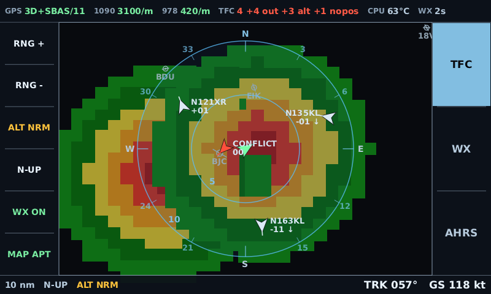

Own-ship centred, range rings, a fully labelled compass rose, and target tags carrying
callsign and relative altitude in hundreds of feet with a climb/descend arrow. The red symbol
is a conflict — co-altitude and closing. Underneath is the FIS-B NEXRAD precipitation mosaic,
drawn as one texture rather than ten thousand paths.

The **top bar** answers "is this thing actually working?": GPS fix and satellite count, the
per-radio message rate for 1090 and 978, traffic counts including targets culled or held back,
CPU temperature, the age of the weather, and — right-aligned — whatever is currently wrong.

The **bottom bar** answers "what have I selected, and what am I doing?": range, orientation and
altitude band on the left, own-ship track and ground speed on the right. Both bars span the whole
panel and the strips sit between them, so the frame reads as two bars with a working area between
rather than as three columns with text loose at the bottom.

### The two culls

`RNG` selects how far out to look; `ALT` selects how far up and down. Above is the default
`ALT NRM` band, ±2700 ft — `TFC 4 +5 out +2 alt` says four targets drawn, five beyond the ring,
two outside the band. Below is the same scene with `ALT ALL`, and the two aircraft at +36 and
+33 are back:

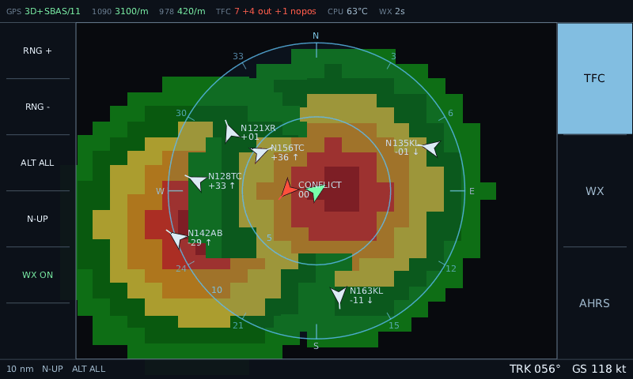

The counts always partition: `drawn + out + alt` is the same number whichever band is selected.
Both the key and the footer readout turn amber only while the filter is *actually* withholding
something, which is why they are amber in the first image and not the second. See
[the vertical filter](#the-vertical-filter) for what it will and will not hide.

### The same page, on real data

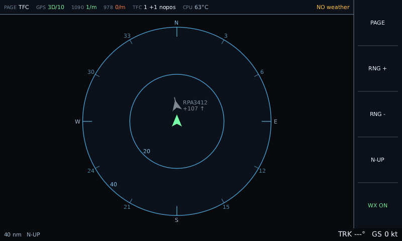

The first real-world capture, replayed: a genuine 3D GPS fix (`GPS 3D/13`) and a real ADS-B
target — `RPA3412 +107 ↑`, Republic Airways, 10,700 ft above and climbing. `978 0/m` in red and
`NO weather` are correct and expected on the ground; FIS-B is line-of-sight from ground stations
aimed at aircraft.

Note `ALT ALL`. At 10,700 ft above, this target is outside the default `ALT NRM` band — under the
default the same frame reads `TFC 0 +1 alt` with an empty ring and an amber `ALT NRM`, which is a
fair illustration of what the vertical filter does on the ground, where everything you hear is
far overhead.

### Weather text

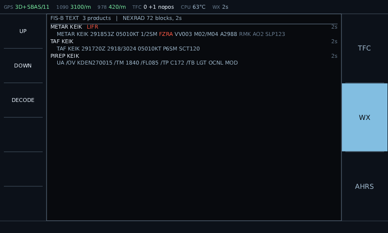

Real observations, pulled from aviationweather.gov moments before this was rendered. Newest first,
each carrying **its own age** — delivery is opportunistic, so one station can be twenty minutes
stale while its neighbour is current and nothing on the wire warns you. Hazards are highlighted
inside the raw text and the flight category is badged (`VFR` here, green).

### Weather, decoded

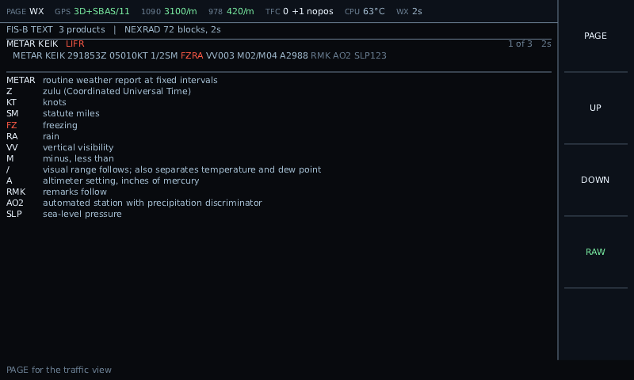

The `DECODE` soft key expands the selected report into every abbreviation it contains, including
the structured groups — `021740Z` resolves through `Z`, `16012KT` through `KT`, `P6SM` through `P`
and `SM`. Sourced from the NWS METAR/TAF card and FMH-1 chapter 5. This is a real KABE forecast
carrying `TSRA`, and the hazard keeps its colour in the expansion so the eye lands on the same
thing twice.

### Attitude

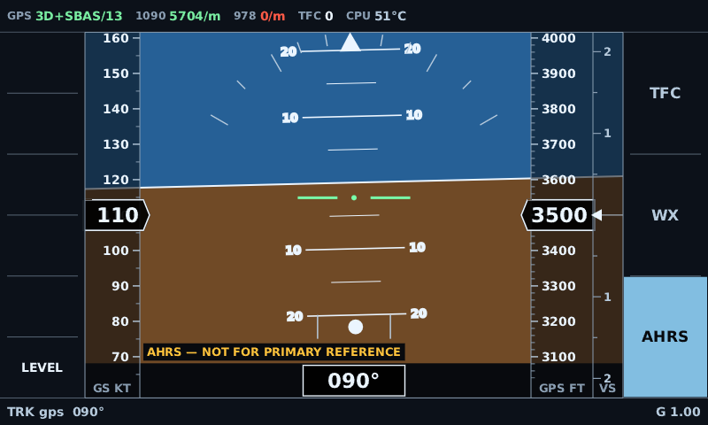

Pitch ladder, roll scale, sky/ground horizon, and moving tapes for ground speed, barometric
altitude, vertical speed and track. `LEVEL` cages the AHRS from the panel.

The footer reads `TRK gps 090°`, not `HDG`. That distinction is the point of the caption: the mag
and gyro headings arrive as the hardware's in-band sentinel `3276.7`, so the source falls back to
GPS track and says which one it is showing.

**`AHRS — NOT FOR PRIMARY REFERENCE` is on screen permanently and deliberately.** There is no
certified IMU here; the attitude comes from a hobby sensor and GPS-derived track.

### Airports and airspace

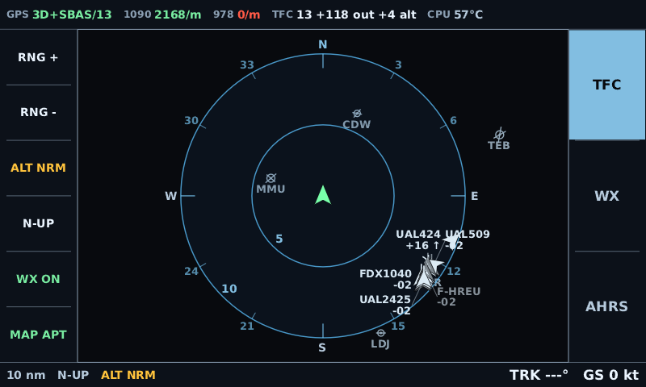

`MAP APT` — airports only. Symbols are sized by tier and carry the identifier a pilot says: `BDU`,
`EIK`, `7CO0`, not `KBDU`. A filled centre means a hard runway. Labels sit below the symbol, as they
do on a sectional, and appear at 10 nm and below — closer in than that they would be competing with
traffic tags for the same space, and traffic wins.

The ticks through the symbols are **runway alignment** — `BDU`'s east-west strip, `EIK`'s
north-south, `7CO0`'s crossed pair. They come from the runway identifier rather than the survey
heading, because the heading column is populated for under a third of runways and the identifier
for all of them, at 10 degrees, which is finer than a tick a few pixels long can show anyway.
Parallel and reciprocal runways collapse, so KORD draws its four distinct angles and not eleven
overlapping lines.

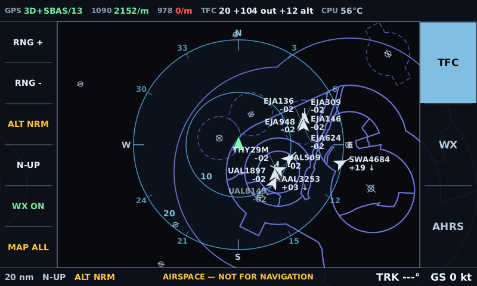

`MAP ALL` adds Class B, C and D. Denver's Class B shelves are the indigo polygons; the dashed circle
around own-ship is Broomfield's Class D. Sectional convention — B and D share a blue and are told
apart by the dash, C is magenta — but the blue is deliberately **indigo rather than the sectional's**,
because the range rings are already cyan and the first attempt read as more rings.

**`AIRSPACE — NOT FOR NAVIGATION` appears in the footer whenever airspace is drawn**, and only then.
Airports alone raise nothing: a misplaced airport symbol costs clutter, whereas a boundary is
something a pilot might fly relative to, and traffic can be checked out of the window in a way a
Class B shelf cannot. That asymmetry is why the two layers are separable at all.

### Tapping an airport

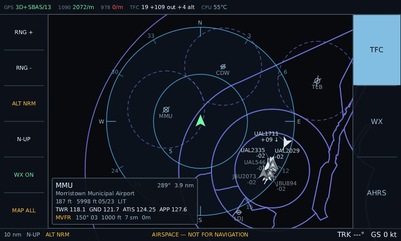

Tap a symbol for its card: name, elevation, longest runway with its designator, the published
frequencies, and where it is from here. `TWR 118.6 GND 121.7 ATIS 126.25 A/D 126.1` at Rocky
Mountain Metro. About 18% of fields have any published frequency — that 18% being essentially every
field you would actually talk to — and the rest say `no published frequency` rather than showing a
blank line.

**If a METAR for that station is already on board, the card grows a weather line**: flight-category
badge, wind, ceiling, visibility, how long ago the report arrived, and `TAF` when a forecast is on
board too. Wind sits first, because the card names the runways two lines above and wind against
runway is the pairing you are actually reading for — `CALM`, `VRB 05`, or `150° 14G21`. Nothing is fetched for this — the reports are already arriving over the Stratux weather socket
and sitting in `AppState` keyed by station, so it works with no internet on the aircraft and costs
one lookup. What it needed was the chart to carry the **ICAO** identifier: METARs are keyed `KMMU`
and the symbol says `MMU`, and deriving one from the other by prepending `K` is right most of the
time and silently wrong sometimes — which here means showing another airport's weather.

Tapping **inside an airspace boundary** shows what is stacked over that point instead — `D TEB
SFC - 2500 ft`, `B JFK 1800 - 7000 ft`, lowest floor first, which is the order you meet them
climbing. It prints the numbers and never says whether you are inside one: own-ship altitude comes
from GPS, which scattered 356 ft while sitting still during the outdoor capture, or from a pressure
sensor on the 29.92 datum. Airspace floors are MSL and compliance is your altimeter on local QNH,
which this box does not have. The card gives you the number to check against it.

**Tapping is the only thing the plan-view body responds to**, and it was inert on purpose: a hand
steadying itself against the panel in turbulence must not change the range or the heading reference.
A card changes no selection, hides no traffic, needs a tap within 18 px of a symbol to open, is
dismissed by any next tap, and lapses by itself after 20 seconds. The reasoning is in
[the design note](docs/airspace-and-airports.md#tapping-an-airport-and-the-rule-it-bends).

The data is built by [`tools/chartdata`](tools/chartdata) from the FAA's own `US_Airport`,
`Runways` and `Class_Airspace` layers, with communication frequencies from OurAirports — all
public domain — see [docs/airspace-and-airports.md](docs/airspace-and-airports.md)
for the measurements behind every threshold, including why a Class D arrives as 3,256 vertices and
leaves as 84, and why the frequency file stores kilohertz.

### Controls

The key strips are the primary interface. Labels are redrawn every frame and toggles are
labelled with the state they are **currently in**, not the state they would move to.

There are two strips, one down each edge. The **left** strip is page-specific function keys; the
**right** strip is the page selector, with every page listed and the active one filled.

| Slot | Plan view | Weather | AHRS |
| --- | --- | --- | --- |
| 1 | `RNG +` | `UP` | — |
| 2 | `RNG -` | `DOWN` | — |
| 3 | `ALT NRM/ABV/BLW/ALL` | `DECODE` / `RAW` | — |
| 4 | `N-UP` / `TRK-UP` | — | — |
| 5 | `WX ON` / `WX OFF` | — | — |
| 6 | `MAP OFF/APT/ALL` | — | `LEVEL` |

The plan view's strip is now full at six. Seven slots would be 60.9 px a key against the 60.0 px
floor the hittability test holds the design to, so the next page-specific control has to displace
something rather than being appended — which is why both map layers share one key.

Splitting navigation onto its own edge is what made room to grow: every slot on the left is now
available to the page that is showing, rather than one being permanently spent on a `PAGE` key.
It also means **nothing on the function strip can move you off the page you are on** — recovering
from a mispress is always a press on the opposite edge.

Direct page selection replaced a cycling `PAGE` key. Every page is one press from every other
rather than up to two, and pressing the key for the page you are already on does nothing — with a
cycle, a press when you were unsure which page you were on was a guess.

The second strip cost **no ring radius at all**. The plan view is height-bound on this panel: it
needs 426 px of width and has 608, so width only begins to bind once the two strips together take
more than 374 px. `outer_radius` is 187.5 px either way.

Nor did it cost the status bar, which runs the full 800 px above both strips. The old `PAGE TFC`
field is gone all the same — the filled page key says the same thing more legibly.

Slot heights, for anyone adding a key: the strips span the 426.2 px between the two bars, so six
left slots are 71.0 px. Seven would be 60.9 px, which still clears the 60 px floor the tests hold
the design to, and eight would be 53.3 px, which does not.

| Gesture | Effect |
| --- | --- |
| Tap the body, weather page | page the list — lower half forward, upper half back |
| Tap the body, plan view / AHRS | **nothing, on purpose** |
| Tap the status bar | **nothing, on purpose** |
| Two-finger tap | north-up ↔ track-up |

Two things that used to react no longer do, for the same reason each time: in turbulence a hand
finds the panel, and a display that changes underneath it is worse than one that ignores it. The
plan-view body used to cycle the range ring, until `RNG` existed. The status bar used to cycle
pages, until the page strip did — three 151 px keys need no fallback, and the old behaviour made
the entire top edge of the panel a page-change target.

### Regenerating the screenshots

No Pi required — the offscreen presenter renders the identical frames headlessly.

```sh
cargo build --release -p avionics -p replay
./target/release/replay synth /tmp/synth.jsonl --duration 240 --targets 10 --conflict --seed 7

./target/release/avionics --replay /tmp/synth.jsonl --speed 8 --offscreen \
    --out /tmp/shots/plan --frames 400 --dump-every 80 --range 10
./target/release/avionics --replay /tmp/synth.jsonl --speed 8 --offscreen \
    --out /tmp/shots/plan-all --frames 400 --dump-every 80 --range 10 --alt-filter all
./target/release/avionics --replay /tmp/synth.jsonl --speed 8 --offscreen \
    --out /tmp/shots/wx   --frames 400 --dump-every 80 --weather-page
./target/release/avionics --replay /tmp/synth.jsonl --speed 8 --offscreen \
    --out /tmp/shots/wxd  --frames 400 --dump-every 80 --weather-page --decode
./target/release/avionics --replay /tmp/synth.jsonl --speed 8 --offscreen \
    --out /tmp/shots/ahrs --frames 400 --dump-every 80 --ahrs-page

# the map layer — the synth session starts at Broomfield CO, under the Denver Class B:
./target/release/avionics --replay /tmp/synth.jsonl --offscreen \
    --out /tmp/shots/map-apt --frames 40 --range 10 --map apt
./target/release/avionics --replay /tmp/synth.jsonl --offscreen \
    --out /tmp/shots/map-all --frames 40 --range 20 --map all
./target/release/avionics --replay /tmp/synth.jsonl --offscreen \
    --out /tmp/shots/map-card --frames 40 --range 5 --map all --inspect BJC

# and the live one, from the recorded outdoor session:
./target/release/avionics --replay captures/2026-08-02-outdoor-gps-3d-fix/session.jsonl \
    --speed 60 --offscreen --out /tmp/shots/live --frames 800 --dump-every 100 --range 40 \
    --alt-filter all
```

The weather and attitude shots above come from `--internet` rather than from synth, because real
reports and a real airborne state beat a fixture:

```sh
cargo run --release -p mock-stratux -- --internet --fly 090@110 &
./target/release/avionics --host 127.0.0.1 --port 8080 --offscreen \
    --out /tmp/shots/net --frames 240 --dump-every 230 --range 20
```

The plan-view shot with the NEXRAD underlay stays on synth: no free feed publishes FIS-B blocks.

Output is PPM; convert with any of `pnmtopng`, ImageMagick, or Pillow.

`captures/` is gitignored — recordings are large and specific to one trip — so the last command
needs a session pulled off the Pi first. See
[recording outside, unattended](#recording-outside-unattended). The other four need nothing but
this repo.

## Hardware

| Part | Detail |
| --- | --- |
| Board | Raspberry Pi 3 Model B **v1.2** (BCM2837, VideoCore IV, 4 cores, 1 GB) |
| Display | Hysong 7" DSI touchscreen — **800x480@60**, `tc358762` bridge + `rpi_panel_attiny_regulator` |
| Touch | `ft5x06` controller, `raspberrypi-ts` / `10-0038 generic ft5x06 (79)`, x `0..=799`, y `0..=479` |
| GPS | Stratux GPYes 2.0, u-blox 8 (`1546:01a8`), USB CDC-ACM on `/dev/ttyACM0` |
| Radios | 2x NESDR Nano 2 (`0bda:2838`) — one 1090 MHz, one 978 MHz |
| USB hub | Powered VL813 |
| Ethernet | Built-in SMSC9512/9514 (`0424:ec00`), USB-attached; a USB RTL8153 (`0bda:8153`) is also fitted |
| OS | Debian 12 Bookworm via the official Stratux image, Stratux 2.0-pre4, kernel `6.6.74+rpt-rpi-v8` |

Platform facts that decide everything downstream:

| | |
| --- | --- |
| dpkg architecture | `arm64` → Rust target `aarch64-unknown-linux-gnu` |
| GPU capability | **OpenGL ES 2.0 only.** `vc4` on the Pi 3 is GLES 2.0 / OpenGL 2.1. GLES 3.x is Pi 4 (`v3d`) and later |
| glibc | 2.36 (`2.36-9+rpt2+deb12u9`) — the ceiling `deploy/check-glibc.sh` enforces |
| CMA | 131072 kB after `cma-128`; `vc4` scanout buffers, the glyph atlas and the NEXRAD mosaic all come from this pool |
| Idle load | 0.24, ~49 °C, `throttled=0x0` |

### Firmware configuration

`deploy/config.txt.fragment` carries the required `/boot/firmware/config.txt` lines and the
kernel cmdline additions. **Read the existing file and reconcile — do not append blindly.** The
key entries:

```
dtoverlay=vc4-kms-v3d,cma-128     # ONE line. Listing the overlay twice instantiates it twice.
dtoverlay=vc4-kms-dsi-7inch       # bundles the edt-ft5406 touch controller
disable_splash=1
boot_delay=0
dtparam=watchdog=on
```

The Stratux image ships neither the KMS overlay nor Mesa; see
[`deploy/enable-kms.md`](deploy/enable-kms.md) and `deploy/push-packages.sh`.

### Things the image did not have

All three were discovered by the binary failing on the target, and all three are fixed by
`deploy/push-packages.sh`:

- **No Mesa at all** — no `libgbm.so.1`, no `libEGL`, no `dri/`. The cross-built binary links
  fine and then cannot exec. This is why `/dev/dri` was missing as much as the overlay was.
- **No `vc4-kms-v3d` overlay** in `config.txt`.
- **No fonts.** The image ships none; `fonts-dejavu-core` is required.

The Hysong panel works under `vc4-kms-dsi-7inch` — rated the likeliest failure, and it was not
one. Note the touch driver names the device **`ft5x06`, not `ft5406`**: grepping
`/proc/bus/input/devices` for "ft5406" or "touch" finds nothing and looks exactly like a missing
device.

## Status

| Milestone | What | State |
| --- | --- | --- |
| M0 | Hardware & OS bring-up survey | **done** — both SDRs, GPS and panel detected; GPS 3D fix achieved outdoors 2026-08-02 (18 satellites seen, 13 locked) |
| M1 | Rendering spike — go/no-go on the stack | **passed on hardware** |
| M2 | Presenter abstraction + interactive dev harness | **done** — offscreen + interactive window |
| M3 | Stratux client + replay harness | **live data flowing** — all five sockets connect, 1090 MHz decoding; not yet diffed against Stratux's web UI |
| M4 | Traffic plan view | **proven on live data** — real own-ship and real ADS-B traffic plotted from a 30 min outdoor capture; frame cost measured, but not yet with both radios busy |
| M5 | Weather: text page + NEXRAD underlay | **renders on the panel**; **no FIS-B received on the ground yet** — 978 needs altitude, so still unvalidated |
| M6 | Kiosk hardening | **scripts written, none run on hardware yet** |
| — | Soft-key strip + AHRS attitude page | **on the panel**; attitude sign conventions verified by tilting the box |
| M7 | Airports + airspace map layer | **on the panel** — 18,108 airports, 1,408 Class B/C/D polygons, runway ticks, tap-to-inspect with frequencies and station weather; all from the FAA's own layers on one AIRAC cycle, measured on the real VC4 under GLES 2.0 |

386 tests passing, clippy clean.

The honest summary: the *stack* is proven end to end on the target — cross-compile, KMS, GLES2,
panel, touch, all five Stratux sockets, live 1090 MHz traffic, and frame cost measured on a
healthy board. What is not proven is anything needing a sky view: UAT reception, NEXRAD
geo-referencing, and frame cost with both radios actually decoding.

## How it fits together

```
dump1090 ─┐
dump978  ─┼─> stratux (Go)  ──ws://127.0.0.1──> stratux-client ──> AppState
u-blox   ─┘                                          │              │ (dead reckoning @ frame rate)
                                          /traffic   │              v
                                          /situation ├────────> avionics-ui ──> femtovg Canvas
                                          /weather   │                │
                                          /status    │                v
                                          /jsonio    ┘          Presenter (GBM+EGL / winit / offscreen)
                                                                      │
                                                                      v
                                                                DRM page flip
```

```
crates/avionics-gfx     Presenter trait + KMS (the real target), windowed and offscreen backends
crates/gfx-spike        M1 go/no-go test pattern
crates/stratux-client   Stratux ingest: wire structs, decoder, state fold, record/replay, synth
crates/avionics-ui      Plan view, NEXRAD underlay, weather page, AHRS, projection, threat tiers
crates/avionics-input   evdev multitouch to gestures
crates/avionics         The display binary
tools/replay            record / synth / stats / play CLI
tools/mock-stratux      a fake Stratux for desk testing, seeded from free public data
tools/chartdata         builds the airport and airspace file from OurAirports and FAA AIS
deploy/                 install, hardening and on-hardware test harnesses
```

**Why the `Presenter` split:** DRM/KMS requires DRM master, which a running desktop compositor
holds — so you cannot iterate on UI code on the dev machine against a real KMS surface. One trait,
three implementations (KMS, winit window, offscreen), and everything above it sees only a
`femtovg::Canvas`.

### Which Stratux socket does what

| Socket | Purpose | Rate |
| --- | --- | --- |
| `/traffic` | traffic updates; **replays current traffic on connect** | ~1 Hz per target |
| `/situation` | own-ship GPS and AHRS | 10 Hz |
| `/weather` | FIS-B text products; does **not** replay on connect | opportunistic |
| `/status` | CPU temp, throttling, per-radio message counts | 1 Hz |
| `/jsonio` | **NEXRAD blocks only** — everything else on it is discarded | ~5 min |

`/jsonio` carries four different message types with no envelope and no discriminator, so the
client dispatches structurally: `Product_id` present → `UATFrame` (keep if `NEXRAD` non-empty);
`Icao_addr` → traffic (drop, `/traffic` has it); `GPSFixQuality` → situation (drop); otherwise
settings (drop). Unknown shapes log once rather than erroring, so an upstream change degrades the
weather underlay instead of taking down the display.

**NEXRAD arrives pre-decoded.** Stratux's `weatherRawUpdate` publishes `UATFrame.NEXRAD` as
geo-referenced, RLE-expanded blocks. No FIS-B APDU / block-63-64 / RLE decoder is needed here.

## Developing without a Pi

> **Exhaust local verification first. The Pi is for confirming a fix, not for finding one.**

Every hardware round-trip costs someone's attention — flashing a binary, watching a panel,
pressing a key on request. A local run costs seconds. This is a house rule because ignoring it
already cost real time: a bug where *every touch resolved to the top of the screen* was chased
through repeated deploys, a corner-touching exercise, and at one point a request to aim at a panel
that had just been blanked. It was reproducible offline the moment raw evdev events had been
captured, and now has eight tests that never need hardware again.

```sh
cargo test --workspace                        # logic, decoders, gesture state machine
cargo clippy --workspace --all-targets

# Generate a deterministic synthetic session and inspect it.
cargo run -p replay -- synth /tmp/s.jsonl --duration 120 --targets 8 --conflict
cargo run -p replay -- stats /tmp/s.jsonl
cargo run -p replay -- play  /tmp/s.jsonl --speed 30

# Render real frames and LOOK at them — no panel required.
cargo run --release -p avionics -- --replay /tmp/s.jsonl --offscreen --out /tmp/frames
cargo run --release -p avionics -- --replay /tmp/s.jsonl --offscreen --ahrs-page --out /tmp/f2

# Interactive, mouse instead of touch, same interaction code as the panel.
cargo run --release --features desktop -p avionics -- --window --replay /tmp/s.jsonl --speed 4

# Capture a real session from the Pi (run from either machine).
cargo run -p replay -- record session.jsonl --host 10.0.0.240 --duration 300
```

Two rules that came out of the same incident:

* **When something can only be observed on hardware, capture the raw data once and move the
  analysis offline.** An evdev event log, a `getSituation` dump, a recorded session — any of these
  turns a hardware problem into a desk problem. `TouchState::apply` exists precisely so captured
  touch events replay with no device attached.
* **Check that a regression test fails without the fix.** Four of the eight touch tests do; the
  other four pass either way and prove nothing on their own. A test written after the fact that
  was never seen to fail is not evidence.

### The desktop harness

`--window` opens a real window via winit/glutin and runs the identical render loop. Left click is
a tap, right click is a two-finger tap, both funnelled into the **same** `avionics_ui::interact`
calls the touchscreen uses — so it exercises the real interaction code, not a parallel
implementation. Keyboard shortcuts (`r`/`R` range, `a` altitude band, `o` orientation, `p` page,
`w` underlay, `esc`
quit) exist because clicking into a specific state is tedious when iterating on drawing code.

It needs `--features desktop`, deliberately **not** in the default set: winit and glutin have no
business being cross-compiled into the binary that ships on the aircraft. `cargo tree -p avionics`
confirms the shipping build pulls in neither.

**It does not verify GLES 2.0 compatibility.** The context is requested as
`ContextApi::Gles(Some(2.0))` to match `vc4`, but EGL treats that as a *minimum* — Mesa returns
"OpenGL ES 3.2" here, and the harness logs a warning saying so. Code that works in the window can
still fail on the panel.

### Testing against a mock Stratux

`--replay` pushes `SourceEvent`s straight into the render loop, which is the right tool for what
gets *drawn* — and it bypasses `stratux_client::live` entirely. The WebSocket handshake, the five
independent reconnect loops, the per-stream staleness clocks, the structural dispatch on
`/jsonio`, and the burst of traffic `/traffic` replays on connect had never run against anything
but a real Pi.

`tools/mock-stratux` closes that. It serves the Stratux wire protocol on the dev machine, seeded
from a snapshot of **real** free public data — aircraft from adsb.lol, METARs and TAFs from
aviationweather.gov. See [`docs/free-aviation-data.md`](docs/free-aviation-data.md) for the
sources, their terms, and what was rejected.

It runs two ways.

**Internet mode** keeps polling, so the display shows what is actually flying right now:

```sh
cargo run --release -p mock-stratux -- --internet --lat 40.7784 --lon -74.3343 --radius 50
cargo run --release --features desktop -p avionics -- --window --host 127.0.0.1 --port 8080
```

**Snapshot mode** captures once and serves it forever, with no network at all afterwards:

```sh
./tools/mock-stratux/fetch-snapshot.sh --out /tmp/snapshot.json     # once, with internet
cargo run --release -p mock-stratux -- --snapshot /tmp/snapshot.json
```

Either way **the display is unmodified** — it takes its ordinary live WebSocket path and has no
idea it is not talking to a Pi. That is the whole point: no `--internet` flag on the display, no
HTTP client in the aircraft binary. `cargo tree -p avionics` shows no `reqwest`, `rustls` or
`hyper`.

#### What it looks like

Live, over New York, own-ship flying east at 110 kt and 3500 ft (`--fly 090@110`):

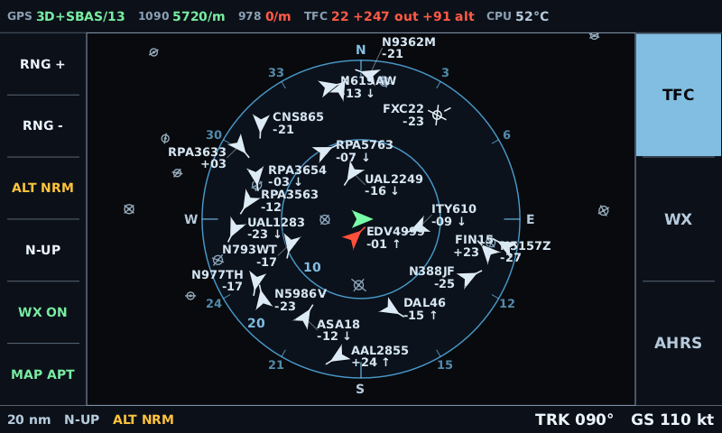

`TFC 17 +163 out +73 alt` — seventeen drawn, 163 beyond the 20 nm ring, and **73 withheld by the
altitude band**, which is why `ALT NRM` is amber in both the key and the footer. The amber symbol
near own-ship is a traffic advisory on a real aircraft.

The same instant with the band opened to `ALT ALL`:

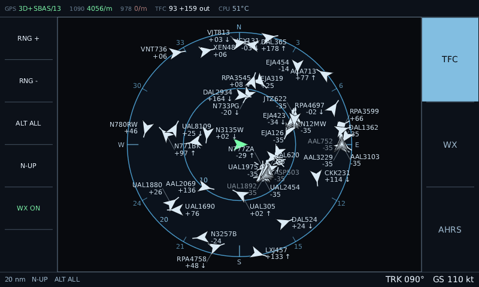

`TFC 93 +159 out`. Ninety-three targets, tags fighting for space and losing. This is the honest
answer to what the display does in the busiest airspace in the country, and it is not something
twelve synthetic targets will ever show you.

New York metro is about 210 aircraft and 40 weather products. Targets are flown forward along
their reported track and speed between polls, so the picture stays alive instead of freezing and
going grey as the dead-reckoner gives up on it — and an arriving poll snaps them back to the
truth, exactly as a real ADS-B update does.

Polling defaults to 5 s for traffic and 10 minutes for weather, tunable with `--poll` and
`--weather-poll`. Both have floors: these are free community services, and the flown-forward
motion means a faster poll buys nothing anyway.

Each poll asks about wherever own-ship is **now**. With `--fly` that matters: a centre captured
once would slide the traffic picture off the aircraft at its ground speed — about 1.8 nm a minute
at 110 kt — until it was flying through a busy sky somewhere behind itself, which looks like
nothing at all until you notice the airport went past.

**Snapshots are gitignored on purpose.** adsb.lol's data is ODbL — attribution and share-alike —
which does not match this repo's licensing. aviationweather.gov is a US Government work and public
domain. The test fixture in `snapshot.rs` is hand-written to the same shape rather than being a
real extract.

Weather is broadcast one product at a time and then **rebroadcast**, cycling round the list, which
is what FIS-B ground stations actually do — it is why a real receiver accumulates weather over
several minutes rather than getting it in one frame. Draining the list instead would leave any
display started later showing `NO WEATHER RECEIVED YET` beside a perfectly healthy server, because
`/weather` deliberately does not replay on connect.

#### Fault injection

The point of a mock is reaching the states hardware makes awkward:

```sh
--drop-every 4              # close every socket every 4 s, to exercise reconnect
--stall situation           # accept the socket but never send: staleness clocks fire
--garbage-every 400         # a malformed frame every 400th message
--fly 090@110               # fly own-ship instead of sitting on the ground
```

`--stall situation` reproduces the first outdoor trip's failure in seconds: radios healthy at
`1090 3304/m`, `GPS NO GPS`, `TFC 0 +204 held`, and the green line saying 204 targets are being
received but cannot be plotted. That indication was built *because* of that trip, and until now
there was no way to see it again without another one.

It does not serve NEXRAD — no free service publishes FIS-B block structures. Use `replay synth`
for the underlay, and for deterministic scenarios generally.

### Recordings

`stratux-client` funnels everything through one channel of `SourceEvent`. A live WebSocket
connection and a replay of a recorded or synthesised session both fill it, and consumers cannot
tell them apart. That is what lets the plan view be developed on the bench and flown without a
code change.

Recordings are JSON Lines with the payload held as a **string**, so they are byte-faithful and a
parser bug seen in flight reproduces on the bench:

```sh
jq -r 'select(.stream=="traffic") | .payload' session.jsonl | jq .
```

`stats` is worth running on any new recording: it reports frame counts *and* what the display
actually managed to decode out of them. A recording full of undecodable frames looks perfectly
healthy by frame count alone.

`synth` is deterministic for a given seed and works by serialising the same wire structs the
decoder reads, so a synthetic session exercises the real parsing path rather than a shortcut
around it. `--conflict` adds a deterministic head-on co-altitude target closing from 4 nm plus a
Mode-S target with no position; random synthetic traffic almost never lands inside the alert box,
so without it the alert path and the no-position counter are never exercised.

## Getting a shell on the Pi

The Stratux image runs its own WiFi AP and has **no route to the internet**. That shapes
everything: nothing here may assume the Pi can reach an archive, and the dev machine cannot reach
the Pi and the internet at the same time if it joins the Stratux AP.

`10.0.0.240` appears throughout as the Pi's address. It is an example — substitute a free address
on your own LAN. It is written out rather than left as `<pi>` so the commands are copy-pasteable.
`stratux.local` is deliberately not used: mDNS does not resolve on this setup, and a hostname that
silently fails to resolve is worse than an address you must edit.

### Wired ethernet — the working path

This is the one to use. The Pi 3B's NIC sits on the same LAN as the dev machine, so both keep
their own connectivity. `eth0` is already configured for DHCP by the image and brought up by
`ifplugd` when it sees a link:

```
# /etc/network/interfaces
# allow-hotplug eth0 # configured by ifplugd
iface eth0 inet dhcp
```

So plug the Pi into your router and it gets an address by itself. Find it by MAC — the Pi 3B's
OUI is `b8:27:eb`:

```sh
ip neigh show | grep -i 'b8:27:eb'          # after pinging the subnet, or just check the router
```

Give it a **DHCP reservation on the router** if you want the address to stay put. That is the
supported way and it does not fight anything on the Pi.

#### If eth0 looks DOWN, check the cable first

```sh
ip -br link show eth0                # NO-CARRIER = no link; neither UP nor NO-CARRIER = admin-down
cat /sys/class/net/eth0/carrier      # 1 = link present
```

`ifplugd` only brings the interface up when a cable is present, so an unplugged Pi shows `eth0` as
`DOWN` with no address and no `dhclient` running. **That is normal, not a fault** — and it is the
first thing to check, because it looks identical to a driver problem. Both NICs enumerating
happily in `lsusb` while both show `DOWN` with an empty `carrier` means a cable, not a board.

### Key-based SSH

```sh
ssh-keygen -t ed25519 -C "dev -> stratux"        # if you have no key
ssh-copy-id -i ~/.ssh/id_ed25519.pub pi@10.0.0.240
```

If `ssh-copy-id` reports `ssh_askpass: ... No such file or directory`, it is being run without a
TTY and never actually prompted. Either run it in a real terminal, or append the public key to
`~/.ssh/authorized_keys` at the Pi's console.

### The WiFi AP — the fallback, and it is marginal

Stratux brings up its own access point on a virtual `ap0` interface carved from `phy0`, alongside
the managed `wlan0`. Current configuration:

| | |
| --- | --- |
| SSID | `Stratux` |
| Security | **open** — `key_mgmt=NONE`, there is no passphrase |
| Pi address | `192.168.10.1` |
| DHCP | dnsmasq, range `192.168.10.10` – `.50` |
| Channel / country | 6 / `US` |

It has been proven end to end — a laptop associated, took a lease, pinged at 8.95 ms and got an
SSH session. But **the link is weak**: SSH over it has timed out repeatedly, and ping has gone to
100% loss mid-session. Treat it as a way to recover a Pi with no cable, not as a working
development path.

Two things to know before relying on it:

- **`WiFiCountry` must be set.** With no regulatory domain the radio reports `phy#0 country 99`
  and `no txcap_blob available` — an uncalibrated transmit power table. Setting it to `US` is what
  made the AP appear on a laptop at all. Set it through Stratux's own settings API or web UI so it
  persists to `/boot/firmware/stratux.conf`.
- **Channel behaviour is uneven and not explained.** Measured by repeated scanning: channel 1
  appeared in **1 of 12** scans, channel 6 in **4 of 4**, channel 11 in **8 of 8**. Congestion is
  not the cause — channel 11 is the busiest band locally and channel 1 the quietest, which is the
  opposite of what congestion would predict. The leading hypothesis is the uncalibrated TX table.
- **`wlan0` being DOWN is expected** while the AP is up. It is the managed-mode half of a
  single-radio `#channels <= 1` phy; it is not a second radio and it cannot be a client at the
  same time.

## Building and deploying

### The cross sysroot

`gbm` links against a real C library, so a bare `cargo build --target …` will not link. Build the
sysroot once — the Pi has no internet, so the `-dev` packages are fetched here instead:

```sh
./deploy/sync-sysroot.sh --offline            # recommended: never contacts the Pi, ~270 MB
./deploy/sync-sysroot.sh pi@10.0.0.240        # mirrors the real machine
```

`--offline` downloads Debian Bookworm packages for the target architecture from `deb.debian.org`,
verified against `/usr/share/keyrings/debian-archive-keyring.gpg` (install
`debian-archive-keyring` if missing), and unpacks them into `./sysroot`. Nothing is installed on
the Pi and nothing on the Pi is modified.

The remote form reads the Pi's `/var/lib/dpkg/status`, downloads only the delta here (typically 3
packages / ~285 KB rather than the full 80-package closure), scp's those over, `dpkg -i`'s them,
then rsyncs the result back. It refuses to downgrade anything on the target unless you pass
`--allow-downgrade` — Stratux images sometimes carry Raspberry Pi's Mesa rather than Debian's.

Prefer `--offline` unless you have a reason to mirror the real filesystem: it does not mutate a
configured flight machine, and it is reproducible from an archive snapshot.

### Deploy

Order matters. Each step is idempotent and says how to undo itself.

```sh
# From the dev machine:
ssh pi@10.0.0.240 'bash -s' < deploy/m0-survey.sh | tee m0-survey.txt
./deploy/sync-sysroot.sh --offline            # one-time
./deploy/deploy.sh       pi@10.0.0.240        # cross-build and push

# On the Pi (deploy.sh puts the scripts in /tmp/avionics-deploy alongside the binary):
sudo /tmp/avionics --check                                     # verify before wiring anything up
cd /tmp/avionics-deploy
sudo AVIONICS_BINARY=/tmp/avionics ./install.sh --dry-run      # see exactly what would change
sudo AVIONICS_BINARY=/tmp/avionics ./install.sh
sudo systemctl start avionics

# Then, in this order:
sudo ./boot-trim.sh                 # disable services with no role here
sudo ./soak.sh --compare            # does the display cost the radios messages?
sudo ./powercut-check.sh baseline   # before starting the power-cut runs
# ... configure Stratux fully, then:
sudo ./overlay.sh enable            # read-only root, last because it freezes settings
```

`avionics --check` verifies the font, the DRM connectors and modes, the touch device, the airport
and airspace file, and whether
Stratux is reachable — and does it **without taking DRM master or the console**, so it is safe to
run over SSH while something else is on screen. It is also wired as `ExecStartPre=`, so a missing
font or a loose DSI ribbon fails with a clear journal message instead of a black panel.

### Recording outside, unattended

For the sky-view work there is no network and nobody watching. `deploy/capture.sh` records a
session, samples board health once a second, and writes a verdict:

```sh
sudo systemctl enable --now avionics-capture.timer   # records 1 min after each boot
# ... carry the Pi out on a battery, power it up, leave it, bring it back ...
sudo systemctl disable avionics-capture.timer
cat /var/log/avionics-capture/*/summary.txt          # check it was a clean run

# Or record once, right now, without the timer:
sudo CAPTURE_DURATION=600 /opt/avionics/bin/capture.sh

# Then from the dev machine:
rsync -av pi@10.0.0.240:/var/log/avionics-capture/ ./captures/
```

It **refuses to record into a RAM overlay** unless forced. That is the whole point of the tool: a
capture whose only value is surviving the walk back indoors must not land in `tmpfs`. Enable
persistent disk first with `sudo touch /overlay/disable && sudo reboot`.

The timer fires one minute after boot, not five. Time to first fix is one of the things worth
knowing about this box, and it can only be measured from a session that was already recording when
the fix landed. The cost is a minute of near-empty frames at the front.

### Hardening decisions

- **The service starts even when Stratux does not.** `avionics.service` is `After=stratux` but
  deliberately not `Requires=`. Both start at power-on and the display usually wins the race; the
  right answer is a panel showing `NO STRATUX CONNECTION` and retrying, not a service that refused
  to start.
- **The font is copied to `/opt/avionics/assets/`, not symlinked.** A display that cannot draw text
  because an unrelated `apt autoremove` took `fonts-dejavu-core` is a reliability bug.
- **The bold face is preferred**, and that is a legibility decision rather than a style one. Live
  testing on the panel reported the text as small and unclear; at the sizes this display uses, a
  regular-weight stem is *one pixel* on a 133 PPI screen, so antialiasing and daylight are both
  eating a large fraction of the only pixel the letter has. Bold draws two. The theme's sizes went
  up at the same time — 11/14 to 14/17 — which costs 11 px of ring radius and 2 px of soft-key
  height, both affordable.
- **The journal is volatile and capped at 32 MB.** Logs survive until reboot — long enough to
  diagnose a flight — and the SD card lasts much longer for it. This matters more once the root
  filesystem is read-only, since the journal then lives in the RAM overlay.
- **The hardware watchdog is armed** (`dtparam=watchdog=on` + `RuntimeWatchdogSec=15`). A hung
  kernel leaves a frozen picture in front of the pilot, which is worse than a blank one because it
  looks live.
- **CPU pinning is written but commented out.** Pinning fixes a contention problem that has not
  been measured. `soak.sh --compare` runs the same window twice, with and without the display, and
  compares Stratux's own ES/UAT message counters — because the failure that matters is invisible
  from inside the display, where traffic just looks a bit thin. Turn pinning on only if that shows
  a real drop; hard-pinning can make things worse on a 4-core part.

### Read-only root, and what it costs

The plan called for bind-mounting a small writable partition over `/etc/stratux.conf` and
`/var/log/stratux` so Stratux settings survive with the overlay enabled. `deploy/overlay.sh` does
**not** do that, and says so at the top of the file:

- It needs the card repartitioned. Automating destructive partition edits on the user's only boot
  medium is a bad trade against the problem it solves.
- The repartition-free alternative (a loopback image on the FAT boot partition) puts the one file
  we care about behind a filesystem with no journal — the very thing the overlay exists to protect
  against. It would look like persistence while being less safe.

So the supported posture is **configure Stratux once with the overlay off, then enable it**.
Changing settings later means `overlay.sh disable`, change, re-enable — a deliberate, infrequent,
on-the-ground operation. The manual procedure for a real persistent partition is documented at the
end of `overlay.sh` for when it is genuinely needed.

## Cautions

### Flying

- **This is not TCAS.** Threat tiers are range-and-relative-altitude boxes with no closure rate and
  no time-to-closest-approach. They exist to draw the eye, not to issue a resolution advisory.
- **The AHRS is not for primary reference**, and says so on screen permanently.
- **Without own-ship altitude, nothing escalates to Alert.** Range-only alerts fire constantly in
  the circuit, and a display that cries wolf gets ignored precisely when it matters. The status bar
  shows `NO ALT REF` when this applies.
- **Targets beyond the selected range are culled, not drawn at the edge.** The count appears in the
  status bar as `+N out`, so a quiet sky is distinguishable from a small range ring.
- **The display comes up filtering.** `ALT NRM` is the default band, so traffic more than 2700 ft
  above or below is not drawn until you press `ALT`. The count is always in the status bar as
  `+N alt` and the band is always named in the footer, but it is a filter, and it is on from
  power-on. Nothing the threat tiers flagged is ever hidden by it — see
  [the vertical filter](#the-vertical-filter).
- **Traffic held for want of an own-ship position appears as `+N held`.** `TFC 0` next to a working
  receiver is the exact reading that sent a real outdoor test looking for an antenna fault when the
  GPS was the thing that had failed.
- **Extrapolation is capped at 3 s** and coasting targets are dimmed. A confident-looking symbol
  several miles from where the aircraft actually is would be worse than an obviously stale one.
- **Precipitation older than 5 / 10 minutes is faded** and dropped entirely at 15. Fading rather
  than hiding, because five-minute-old weather is still useful provided it is visibly not current.
- **There is no bus voltage**, despite the original mockup showing one. Stratux's status structure
  has no voltage field and this build has no other power sensor, so a number there would be
  invented.

### Power, radios and clocks

- **Do not raise the underclocks.** `config.txt` carries `sdram_freq=450`, `core_freq=450`,
  `arm_freq=900` — deliberate underclocks from Stratux issue #573 that reduce EMI. On this box they
  protect SDR and GPS reception. `core_freq=450` caps GPU throughput and was expected to cost
  frames at 800x480. It does not.
- **Watch the supply.** With the hub, GPS and both SDRs connected the Pi once reported
  `throttled=0x50005` — under-voltage *and* actively throttled — at 43 °C, so it was supply, not
  heat. The hub enumerates with `bMaxPower=0mA` while carrying 1280 mA of downstream devices.
  Throttling starves `dump1090`/`dump978` of exactly the CPU that must not be starved. It is now a
  six-second boot transient rather than a sustained state, but a board that dips at boot is one bad
  cable away from dipping in flight.
- **Tag both SDR serials.** Serials once read `stx:978:0` and `stx:0:0`; Stratux assigns 1090 vs
  978 by that tag, so an untagged dongle's role is not pinned and the two can swap across reboots,
  silently feeding each antenna to the wrong demodulator. See
  [`deploy/sdr-serial-tagging.md`](deploy/sdr-serial-tagging.md), which also explains why
  `apt install rtl-sdr` on the Pi is a trap — it would downgrade the `librtlsdr0` that `dump1090`
  is linked against.
- **Give the GPS time.** A genuine u-blox cold start with no almanac took **13.8 minutes** to first
  fix here. An outdoor test shorter than that will fail regardless of what the antenna is doing —
  which is exactly what happened on the first attempt.

### Things that have bitten, on the Pi

- **Never `pkill -f` a pattern that could match your own session.** `pkill -f
  "wpa_supplicant.*ap0"` killed the SSH connection issuing it and took the AP down with it; a
  `pkill -f cap.py` had already done the same thing earlier in this project. Match on PID, or use
  `systemctl`.
- **Do not "fix" a `DOWN` eth0 with a static address in a systemd unit.** It was tried. On a Pi 3
  the NIC is USB-attached and enumerates late, so a unit ordered on `network-pre.target` fails with
  `Cannot find device "eth0"` on some boots and wins on others — the address then flaps between the
  static one and the DHCP one, seemingly at random. Let `ifplugd` and `dhclient` do their job.
- **`dhclient` lives in `/sbin`, which is not on a non-root user's `PATH`** on Debian. `which
  dhclient` as `pi` finds nothing and it looks as though no DHCP client is installed. It is —
  `isc-dhcp-client`. Check with `ls -l /sbin/dhclient` or `dpkg -l isc-dhcp-client`.
- **Permission denied is not read-only.** A `touch` failing as `pi` under `/var/log` is EACCES, not
  EROFS. Re-test as root before concluding the overlay is engaged.
- **`panic = "abort"` in the release profile means `Drop` does not run.** A panic leaves the
  console in graphics mode; `sudo chvt 1` recovers it. This is the right trade for the shipping
  kiosk — fail fast, let systemd restart clean — but it surprises you during development.

### Things that have bitten, in the scripts

- **`set -euo pipefail` aborts on `v=$(pipeline-that-finds-nothing)`.** This bit both hardening
  scripts: a Stratux that simply was not running would kill a 30-minute soak, and a `grep` with no
  match would abort the power-cut check halfway, reporting neither pass nor fail. Guard every
  extraction with `|| true` and default the value.
- **A pipeline's exit status is the *last* command's.** `vcgencmd ... | cut ...` always succeeds,
  so a fallback keyed on the exit status can never fire. Do not put the command you are testing on
  the left of a pipe.
- **`systemctl is-active` prints its answer *and* exits non-zero** for an inactive unit, so
  `systemctl is-active foo || echo unknown` emits two lines.
- **Never report a clean run for something you did not measure.** Both the throttle check and the
  GPS/AP check once printed a pass when the sample count was zero. Count the samples and print
  `NOT MEASURED`.
- **Sticky bits are not live bits.** `get_throttled` bits 16–19 are since-boot; the low nibble is
  now. A six-second boot transient once condemned thirty minutes of good data, and a warning that
  cries wolf is one you learn to ignore.

## Measured results

### M1 — the go/no-go, on hardware, 2026-07-31

```
resolution : 800x480
vendor     : Broadcom
renderer   : VC4 V3D 2.1
version    : OpenGL ES 2.0 Mesa 24.2.8-1~bpo12+rpt5
GLES2 path : true
frames     : 300
last fps   : 60.0
```

**`GLES2 path : true` is the result the whole project was waiting on.** femtovg's README claims
"OpenGl (ES) 3.0+", and the stack rested on the claim that its *runtime* ES2 detection
(`version.starts_with("OpenGL ES 2.")`) actually works on `vc4`. It does. The Slint `linuxkms`
fallback is not needed.

### Frame cost, 2026-08-01

Measured at a full 900 MHz, `throttled=0x0`, 57 °C. Everything recorded before that date was taken
at 600 MHz under the under-voltage throttle and is superseded. Each run is 150 s of the same
replay, per page:

| Page | rate | mean draw | worst draw | worst steady | core share |
| --- | --- | --- | --- | --- | --- |
| Plan view + NEXRAD underlay | 30 fps | **2.30 ms** | 58.6 ms (frame 1) | **30.0 ms** | 6.9% |
| Plan view, no underlay | 30 fps | **2.25 ms** | 57.3 ms (frame 1) | **6.8 ms** | 6.8% |
| AHRS (uncapped) | 60 fps | **2.72 ms** | 68.3 ms (frame 1) | **6.7 ms** | 16.3% |
| Weather, decoded | 8 fps | **3.68 ms** | 141.7 ms (frame 1) | **7.4 ms** | 2.9% |
| Weather, list | 8 fps | **4.09 ms** | 65.8 ms (frame 1) | **8.5 ms** | 3.3% |

The map layer, measured the same way on 2026-08-03 but against the outdoor capture at 20 nm, so
own-ship and the New York Class B are real:

| Map layer | mean draw | worst steady |
| --- | --- | --- |
| `--map off` | 2.05 ms | 12.70 ms |
| `--map apt` | 2.40 ms | 13.44 ms |
| `--map all` | 5.39 ms | 16.33 ms |

Airports cost 0.35 ms a frame and airspace 3.0 ms, holding 30.2 fps throughout. The airspace half
is the dashed Class D boundaries, which femtovg re-tessellates on the CPU.

`worst steady` excludes the first 30 frames *and* the first 5 seconds. Both floors are needed: a
frame count is reached in very different wall time at 8 Hz and 60 Hz, and an elapsed time can be
satisfied by a single frame that took seconds to present. Reporting **which frame** the worst
landed on is what makes the rest of this table readable.

**Every `worst draw` is frame 1.** The vc4 shader compile, the glyph atlas and the initial DSI
modeset are paid once, before anything is on screen. The 141.7 ms on the decoded weather page is
the largest because that page shapes twenty-seven previously unseen strings against a cold atlas;
it is also a page the display never starts on.

**The one recurring hitch is the NEXRAD composite.** 30.0 ms with the underlay against 6.8 ms
without, from three composites in 150 s. At 30 fps a 30 ms draw overruns the 33 ms budget, so a
composite costs about one frame. Three frames in two and a half minutes is not worth chasing, but
the lever if it ever matters is `MosaicConfig::texture_size`: 1024 → 512 is a quarter of the work
and a quarter of the 4 MB upload, and at 120 nm across still resolves finer than the NEXRAD bins.

**Capping the frame rate per page roughly halved the plan view's share of a core**, 12.8% → 6.9%,
with no visible change: at 40 nm range a 150 kt target moves three thousandths of a pixel per frame
at 60 Hz. The caps are confirmed on hardware — the runs above report 30.3, 60.1 and 8.0 fps against
targets of 30, uncapped and 8. See `Page::frame_interval`.

An earlier 45-minute live AHRS run sampled `last fps: 32.6` at exit where every other run read
60.0, and it was recorded unexplained rather than rationalised. The AHRS page now holds **60.1 fps
across 8607 frames** on a healthy board — consistent with the old sample being the throttle, but
not proof, since this run was 150 s of replay rather than 45 minutes of live data. Settling it
needs a long live run on the fixed supply.

### First outdoor capture — 2026-08-02

Thirty minutes on a battery at Morristown NJ, recorded unattended by `deploy/capture.sh`.
**This is the first real-world data the project has.**

```
own-ship      : 40.7784, -74.3343 (3D)     <- the M0 GPS exit criterion
frames        : 69572 over 1799.9 s, 0 decode errors
gps           : peak 18 satellites seen, 13 locked
first 3D fix  : t = 828 s   (13.8 minutes)
radios        : 115 ES (1090) messages, 0 UAT (978)
access point  : up for 141 of 141 samples
throttled     : 0x50000 (sticky, set during boot)
```

The plan view was rendered from this recording and plotted a real target — see
[the screenshot above](#the-same-page-on-real-data). That is M4's core function working on live
data rather than synthesis.

**Zero UAT is not a fault.** FIS-B ground stations are line-of-sight and aimed at aircraft; on the
ground you often hear nothing. Weather needs altitude, so M5 stays unvalidated until this flies.

### What is still unproven

- **Radio contention.** `dump1090`/`dump978` are not decoding indoors, so "the renderer starves the
  radios" — the plan's real failure mode — is still unmeasured. 6.9% of a core on an otherwise idle
  board is encouraging and not conclusive: what matters is SDRAM bandwidth shared with two SDRs
  doing USB bulk transfers, and that cannot be measured without signal.
- **Gestures.** Device discovery and coordinate scaling are confirmed; `BTN_TOUCH`, slot count and
  `ABS_MT_TRACKING_ID` lifetimes need a finger. `touch: OK` in `--check` means the device opened,
  not that tap and two-finger-tap work.
- **NEXRAD geo-referencing.** The mosaic renders, but has not been checked against an independent
  archived NWS mosaic for the same period.
- **Airspace position.** The boundaries draw on the panel and cost what the table above says, but
  no one has yet held the panel next to a sectional and checked that a Class B shelf is where it
  claims to be. Until that happens the `NOT FOR NAVIGATION` banner is the whole of the guarantee.
- **The AP's uneven per-channel behaviour**, described under [the WiFi AP](#the-wifi-ap--the-fallback-and-it-is-marginal).

## Reference notes

### Running the M1 spike

M1 answers one question on real hardware: **does femtovg's OpenGL ES 2.0 path work on the Pi 3's
`vc4` driver, rendered straight to DRM/KMS?** It does. The spike is kept because it is the fastest
way to re-answer the question after a Mesa, kernel or overlay change, and because it isolates the
graphics stack from everything else when something breaks.

```sh
# On the dev machine (headless, writes an image — no Pi and no DRM master needed):
cargo run -p gfx-spike -- --offscreen --out /tmp/spike.ppm

# On the Pi, from a console with no X/Wayland running:
./deploy/sync-sysroot.sh --offline
./deploy/deploy.sh       pi@10.0.0.240
ssh -t pi@10.0.0.240 'sudo /tmp/gfx-spike'
```

The test pattern is diagnostic, not decorative. Each element proves one capability a later
milestone needs, so a partial failure localises the problem:

| Element | Proves | Needed by |
| --- | --- | --- |
| Range rings | Stencil path fill + stroke on arcs | M4 plan view |
| Rotating chevrons | Nested transforms | M4 traffic symbols |
| Text at 9/11/14/18 px | Glyph atlas upload and shaping | M4 tags, status bar |
| POT **and** NPOT mosaics | Texture upload + image paint | M5 NEXRAD underlay |
| Alpha ramp | Blending | M5 stale-weather fade |
| FPS counter | Sustained throughput at native res | everything |

A missing or corrupt **NPOT** mosaic is not a failure — GLES 2.0 only guarantees non-power-of-two
textures with `CLAMP_TO_EDGE` and no mipmaps. It means M5 must pad the mosaic to a power of two.

A blank screen, missing text, or unfilled rings **is** a failure. Before rewriting anything, check
`dmesg` for `vc4`/CMA errors and cross-check the driver with `kmscube` and `eglinfo` from
`mesa-utils`. If femtovg's ES2 path is genuinely broken on `vc4`, Slint's `linuxkms` backend solves
this exact DRM/GBM/EGL/femtovg-on-GLES2 problem and is the fallback to evaluate — before building
UI on a broken foundation.

### The vertical filter

`ALT` is the vertical counterpart of `RNG`. The bands are Garmin's, from the GTS/GTX traffic
pages, so a pilot who has flown behind a GTN reads this correctly with no learning:

| Band | Above | Below |
| --- | --- | --- |
| `ALT NRM` | +2700 ft | −2700 ft |
| `ALT ABV` | +9000 ft | −2700 ft |
| `ALT BLW` | +2700 ft | −9000 ft |
| `ALT ALL` | unrestricted | unrestricted |

This is the only mechanism on the display that deliberately removes a received, positioned,
in-range target from the screen, so what it **cannot** hide matters more than what it can:

- **Anything the threat tiers flagged is drawn, whatever the band says.** The filter removes
  clutter, and an Advisory or Alert is not clutter. This is structural rather than arithmetic on
  purpose. It happens to be redundant today — the narrowest band is ±2700 ft against an advisory
  tier of ±1200 ft, so the numbers alone would keep every flagged target on screen — but "these
  two constants are in the right relationship" is exactly the kind of fact that quietly stops
  being true when somebody tunes one of them, and the failure mode is a flagged target vanishing
  from a traffic display. Both halves are tested.
- **A target whose relative altitude is unknown is never filtered.** You cannot exclude what you
  cannot measure. This is the ordinary case on the ground, where own-ship has no altitude
  reference, every tag reads `---` and the status bar shows `NO ALT REF`.
- **Nothing is hidden silently.** `+N alt` appears in the status bar and the band is named in the
  footer at all times, including when it is `ALT ALL` and hiding nothing — a pilot who has
  deliberately opened the filter up should see that they did, not have to infer it from an
  absence.
- **A target outside both culls counts only as out of range**, because range is tested first.
  Counting it twice would make `+N out` and `+N alt` sum to more traffic than is actually being
  withheld, and each would overstate what pressing its own key would bring back.

Rejected: *dimming* out-of-band traffic instead of hiding it. Safer, but self-defeating — the
reason to filter is to remove clutter, and a dimmed symbol is still clutter.

### The NEXRAD underlay

Blocks are composited into a single 1024x1024 RGBA texture in **latitude/longitude space**, then
drawn as one rotated quad beneath the range rings. Two reasons for that shape:

- A full picture is ~100 blocks x 128 bins. As paths that is >10,000 draw calls per frame, which
  `vc4` will not do at 30 Hz. As one texture it is one draw call.
- Laying the texture out in lat/lon rather than screen space means heading changes in track-up do
  not invalidate it. Screen-aligned, every turn would force a rebuild several times a second.

The longitude span is divided by cos(latitude) so the texture covers a *square patch of ground*,
matching the projection; without that the mosaic would be stretched ~30% east-west at mid latitudes
and weather would appear displaced along track.

Rebuilds are driven off things that actually changed, never a timer: the block set
(`AppState::nexrad_revision`), own-ship drifting >10 nm from the patch centre, or a change in
`fade_fingerprint`, which buckets block age into three steps so fading causes at most two rebuilds
per block lifetime rather than one every 30 s.

### The cross-glibc trap

**`deploy/check-glibc.sh` exists because this bug is invisible until the Pi refuses to exec the
binary.** `deploy.sh` runs it automatically; run it by hand after any manual build:

```sh
./deploy/check-glibc.sh target/aarch64-unknown-linux-gnu/release/avionics
```

Ubuntu 26.04's cross toolchain carries glibc 2.43, and 2.43 **re-versioned the float maths
functions** — its libm exports `acosf@@GLIBC_2.43` as the default where Bookworm exports
`acosf@@GLIBC_2.17`. femtovg's trig picks those up, so a binary that links cleanly and reports the
right architecture dies on the Pi with ``version `GLIBC_2.43' not found``.

Two separate things have to be right, and both are easy to get wrong:

1. **The sysroot needs a complete `libc6-dev`**, not just the runtime `libc6`. Without
   `libc.so`/`libm.so`/`crt1.o` in the sysroot the toolchain quietly falls back to its own.
2. **Absolute symlinks must be rewritten to stay inside the sysroot.** Debian ships
   `usr/lib/<triple>/libm.so -> /lib/<triple>/libm.so.6`; that leading slash resolves against the
   *host's* root, so `ld` links the dev machine's glibc even though `--sysroot` is set.
   `sync-sysroot.sh` relativises them; rsync's `--copy-unsafe-links` covers the mirror path.

The sysroot search path also has to come *before* the toolchain's built-in one. Neither
`-C link-arg=-L…` nor `-L native=…` can do that — rustc emits both after its own `-l` flags, and
`ld` resolves each `-l` against only the `-L` paths seen so far. That is why `.cargo/config.toml`
points `linker` at `deploy/cross-cc-<triple>.sh` instead of at the cross-gcc directly.

### Graphics-stack gotchas

- **`drm` is pinned to 0.14, not the newer 0.15.** `gbm` 0.18's `drm-support` feature is built
  against 0.14. Mixing them puts two `drm` crates in the graph, and `BufferObject` then fails to
  implement the `drm::buffer::Buffer` that `add_framebuffer` wants. Bump both together.
- **Cross-linking needs only `libgbm`.** The `drm` crate talks to the kernel through
  `rustix`/`linux-raw-sys` (no libdrm), and `khronos-egl` uses its `dynamic` feature so libEGL is
  `dlopen`'d at runtime. Confirmed on the finished binary — `DT_NEEDED` is exactly `libgbm.so.1`,
  `libgcc_s.so.1`, `libm.so.6`, `libc.so.6`, all four of which the Stratux image already has.
  **Nothing needs installing on the Pi to run this.** The full sysroot mirror is convenience, not
  necessity.
- **femtovg's `Canvas::set_size()` secretly emits a `SetRenderTarget(Screen)` command** without
  updating the canvas's own `current_render_target` cache. Since `set_render_target()` is a no-op
  when that cache already matches, a later `set_render_target(Image(..))` gets silently dropped and
  you draw into the default framebuffer instead. In a surfaceless context that FBO is incomplete,
  so every draw fails with `GL_INVALID_FRAMEBUFFER_OPERATION` and the output is blank. See
  `bind_target` in `crates/avionics-gfx/src/offscreen.rs`. Don't call `set_size` per frame.
- **femtovg needs a stencil buffer.** Its path fill is stencil-based, so any EGL config must
  request `STENCIL_SIZE >= 8` or paths silently draw nothing.
- **Requesting a specific GLES version via EGL is a floor, not a match.** Asking for
  `Gles(Some(2.0))` on Mesa yields an ES 3.2 context, so a desktop harness cannot enforce the Pi's
  ES2 constraints no matter how it asks. Log the negotiated version and treat the hardware as the
  authority.
- **VT ownership is taken unconditionally.** `KDSETMODE`/`KD_GRAPHICS` on the active tty so `fbcon`
  stops drawing over us, restored on exit. VT-switch handling (`VT_SETMODE` + signals) is
  deliberately not implemented — this is a single-purpose kiosk and there is nothing to switch to.

### On the Stratux side

- **No HTTP polling is needed.** `/status` pushes `globalStatus` every 1 s and `/situation` pushes
  `mySituation` every **100 ms**, both on a plain ticker. The plan originally called for polling
  `GET /getStatus`; the `/status` socket removes any need for an HTTP client.
- **`/weather` does not replay the current buffer on connect**, despite the HTTP API docs saying it
  does. `handleWeatherWS` only calls `weatherUpdate.AddSocket(conn)`. Consequences: weather must
  never be cleared on reconnect (see `AppState::apply`), and a fresh start shows no weather at all
  until the next FIS-B cycle — minutes for text, ~5 for NEXRAD.
- **`/traffic` *does* replay current traffic on connect**, so a reconnect re-populates targets by
  itself and stale ones age out naturally.
- **Positions are Go `float32`.** `TrafficInfo.Lat/Lng` and `SituationData.GPSLatitude/Longitude`
  carry ~1e-6 degrees (~0.2 m) of rounding once widened to `f64`. Fine for a plan view; never
  compare a position for equality or use one as a map key.
- **Go field names are the JSON keys** — no `json:` tags anywhere in these structs, so an upstream
  rename is a silent breakage. Every field is `#[serde(default)]` and deserialisation is lenient,
  which turns that into a visible degraded indication rather than a crash.
- **`TRAFFIC_SOURCE_*` values**, confirmed upstream: 1090ES = 1, UAT = 2, OGN = 4, AIS = 8. These
  drive the "which radio heard this" indication, so guessing them wrong is user-visible.
- **The two NEXRAD products do not share an intensity scale.** Upstream fills an empty *regional*
  block with 0 and an empty *CONUS* block with 1, which is the tell: on regional, 0 means "looked,
  below 5 dBZ", whereas on CONUS that state is 1 and 0 means "no data at all". So CONUS is offset by
  one. Treating them alike paints phantom precipitation everywhere or punches holes through real
  coverage — and both failures look completely plausible on screen.
  `crates/avionics-ui/tests/weather.rs` pins this, along with transposition and mirroring.
- **`UAT_messages_last_minute` comes *before* `ES_messages_last_minute`** in Stratux's status JSON.
  Extracting both with one order-dependent grep silently swaps them, and a soak report that blames
  the wrong radio is worse than no report. Pull status fields by name.
- **Stratux uses `golang.org/x/net/websocket`**, the old Go package. It does no ping/pong keepalive,
  so a wedged socket is detected by the per-stream staleness clock rather than by the transport.
  Timeouts are per-stream because the natural rates differ by orders of magnitude — 3 s for 10 Hz
  own-ship, 600 s for weather.
- **The canonical repo moved** to `github.com/stratux/stratux`. `cyoung/stratux` is the dormant
  original; its `notes/app-vendor-integration.md` is still the best prose description of the wire
  protocol, but its field lists are outdated.

### Out of scope for Phase 1

No terrain. No traffic audio alerts. No flight logging or track recording. No touch-driven Stratux
configuration — the web UI on the retained AP covers that.

Airports and airspace **were** on this list and now draw — see
[the panel section](#airports-and-airspace) and
[docs/airspace-and-airports.md](docs/airspace-and-airports.md). What is still deliberately absent is
the **vertical** part: the file carries every volume's floor and ceiling, and nothing yet highlights
the shelf you are in or about to enter. That is the most useful half and the half most able to be
confidently wrong, so the lateral boundaries get flown and checked against a sectional first.
